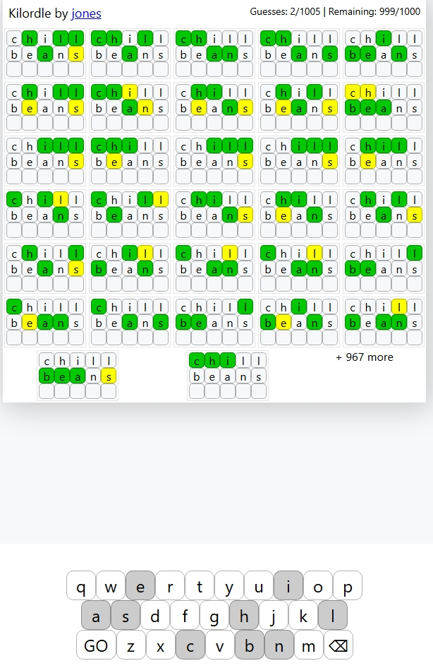

# Kilordle

Kilordle is an extreme Wordle variant where you solve **1000 Wordle puzzles at the same time**.

Each guess is applied to every puzzle simultaneously. Your goal is to solve all boards before running out of guesses.

> Example: `Guesses: 2/1005 | Remaining: 999/1000`

---

## 📸 Screenshot



---

## 🎮 How It Works

- Each board contains a hidden 5-letter word.
- When you enter a guess, it is submitted to **all active boards**.
- Every board evaluates the guess independently using standard Wordle rules:

| Color | Meaning |
|-------|----------|
| 🟩 Green | Correct letter, correct position |
| 🟨 Yellow | Correct letter, wrong position |
| ⬜ Gray | Letter not in the word |

You win when all 1000 puzzles are solved.

---

## 🛠 Tech Stack

- React
- TypeScript
- CSS
- Seeded word generation
- Custom utility logic for letter evaluation

---

## 📁 Project Structure

```
kilordle/
│
├── public/
│
├── src/
│   ├── components/
│   │   ├── Header.tsx
│   │   ├── Keyboard.tsx
│   │   ├── Puzzle.tsx
│   │   ├── Puzzles.tsx
│   │   └── EndScreen.tsx
│   │
│   ├── util/
│   │   ├── checkValidity.ts
│   │   ├── generateWordlist.ts
│   │   ├── isYellow.ts
│   │   ├── seedRandom.ts
│   │   ├── sortByValue.ts
│   │   └── words.ts
│   │
│   ├── App.tsx
│   └── index.tsx
│
├── prettier-plugin/
└── package.json
```

---

## 🚀 Getting Started

### Install dependencies

```bash
npm install
```

### Run development server

```bash
npm start
```

App runs locally at:

```
http://localhost:3000
```
